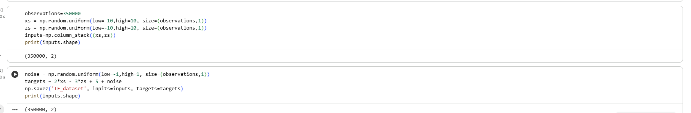
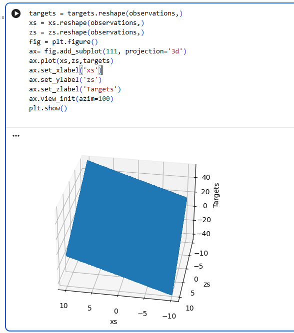
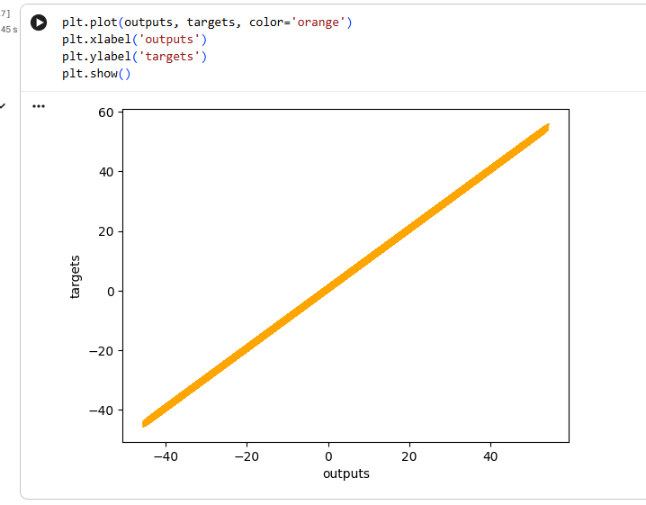
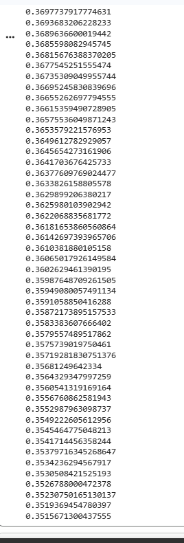
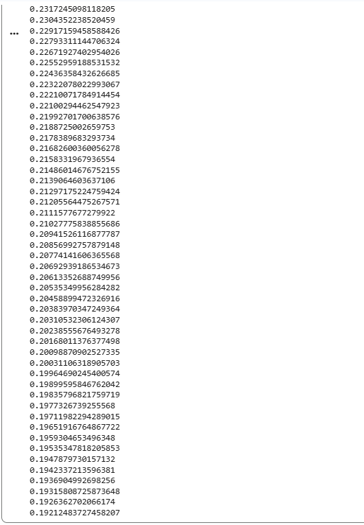
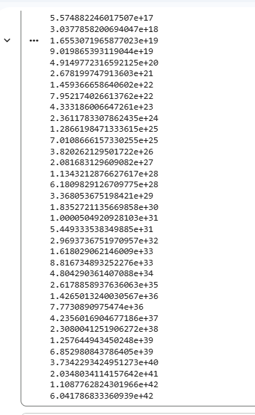
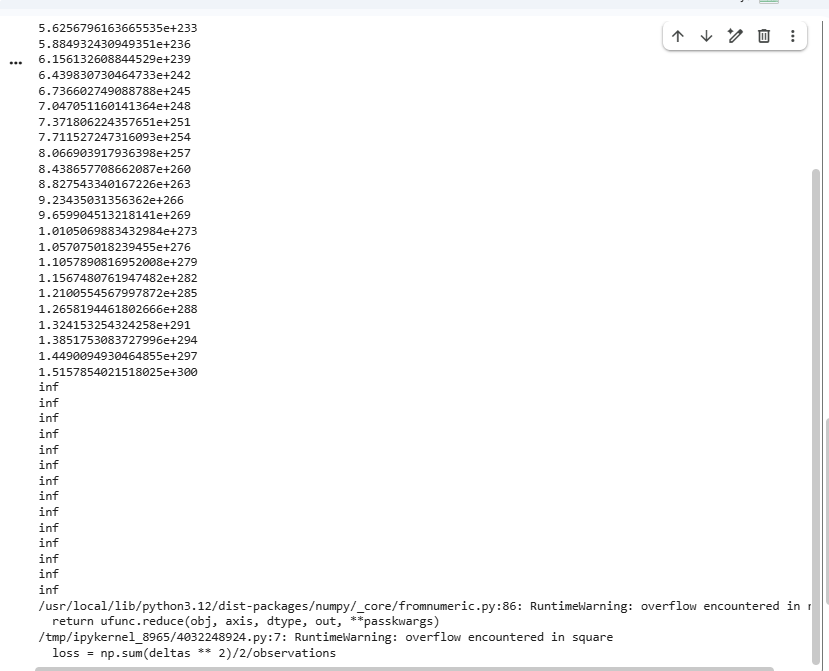
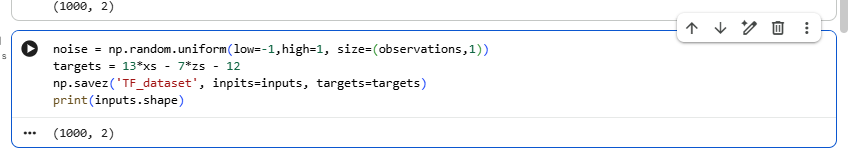
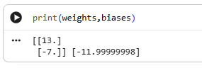

# SI_lab1
## Autor:  21255
### Laboratorium 1 - Model Liniowy
1. Zmiana ilości próbek – np. 1000000 itp.

2. Zmiana współczynnika uczenia się eta: 
a. 0,0001 - bardzo powolna nauka modelu

b. 0,001 - bardzo powolna nauka modelu

c. 0,1 - przyzwoita nauka modelu

d. 1 - przesyt nauki modelu (za duże liczby ety)

3. Zmień targets na np. targets = 13 * xs + 7 * zs – 12 i sprawdź czy model znajdzie prawidłowe wagi i biasy czyli: 13, 7 i -12

